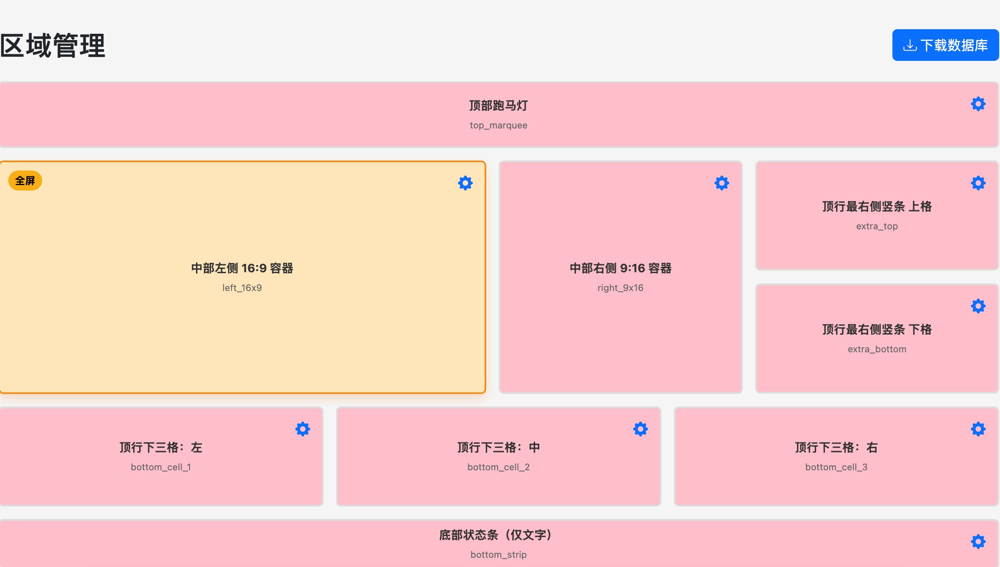
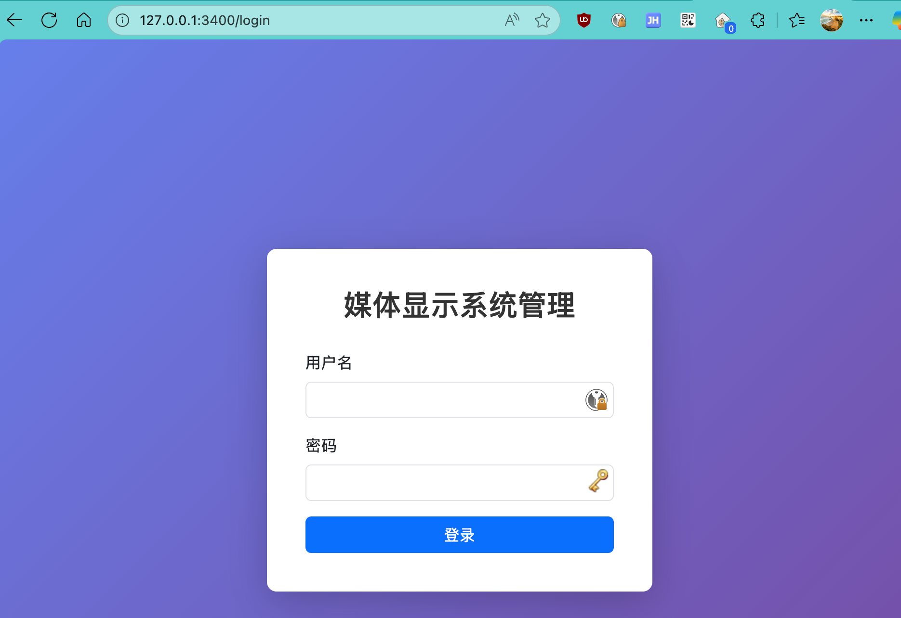
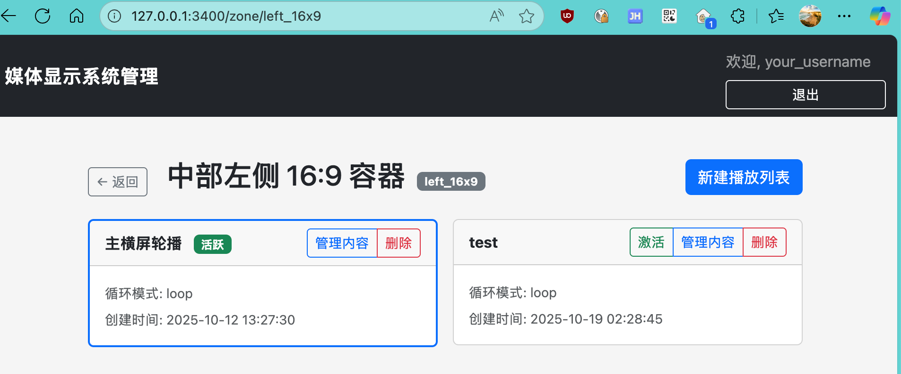
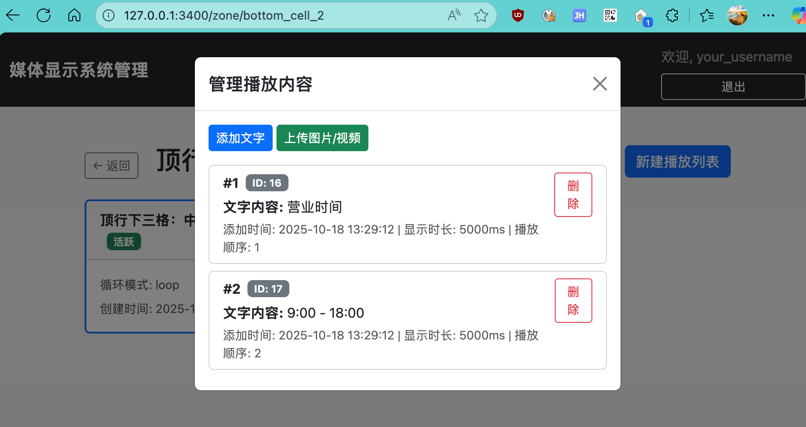
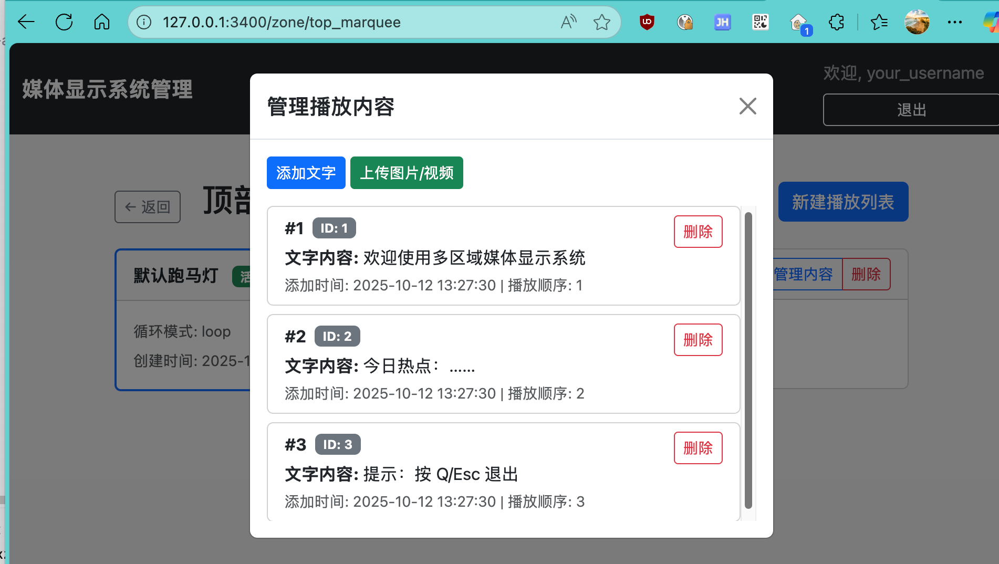
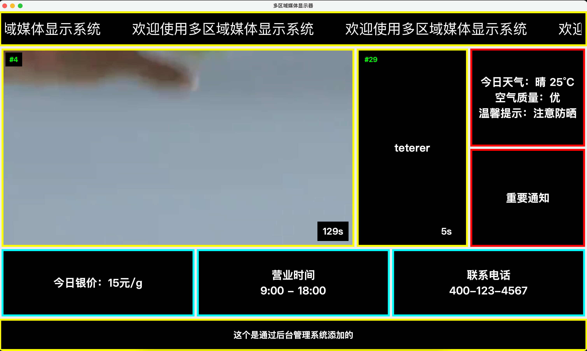

# 多区域媒体显示系统

这是一个专为 数字标牌、展示屏 和 信息发布系统 打造的开源多区域媒体播放解决方案。系统采用模块化架构，可在同一块屏幕上同时展示多个独立的播放区域，每个区域都能灵活播放不同的图片、视频或文字内容，完美适用于商场、展厅、会议室、公共信息屏等多种场景。

系统支持 远程集中管理，可通过 Web 控制台或 API 实现内容的在线上传与更新，支持 实时同步播放。无论是在本地局域网还是公网环境中，都能快速推送新的视频、图片或文字信息，让屏幕内容即时生效，大幅提升信息发布的效率与灵活性。

此外，它还内置 家庭智能相册模式，可自动从 NAS 设备中读取照片和视频，并以多区域布局在大屏幕上动态播放，为家庭打造沉浸式的 数字相框与家庭影院体验，让珍贵影像实时呈现、持续轮播。

## 📸 产品截图

### 主显示界面


### 登录界面


### 播放列表管理


### 播放项管理


### 播放项详情


### 在设备上显示预览

## ✨ 核心特性

- 📁 **NAS 自动同步** - 自动挂载群晖/威联通等 NAS，读取家庭相册和视频
- 🎬 **智能播放列表** - 每日自动生成播放列表，随机展示不同的照片和视频
- �️ ***多区域布局** - 支持 9 个独立显示区域，同时展示多张照片或视频
- 📺 **全格式支持** - 支持 JPG、PNG、HEIC、MP4、AVI、MOV 等常见格式
- � **实时更新**  - NAS 新增照片自动同步，无需手动刷新
- � ***远程管理** - Web 界面远程管理播放内容和设置
- 🎨 **个性化定制** - 跑马灯文字、倒计时、边框颜色等自由配置
- 📊 **完整日志** - 详细的运行日志，方便问题排查

## 🏗️ 系统架构

系统由三个独立服务组成：

### 1. Admin 服务 (端口 3400)
- Web 管理界面
- RESTful API
- 播放列表管理
- 媒体资源管理

### 2. Schedule 服务 (端口 3700)
- 自动挂载 NAS（支持 SMB/NFS）
- 自动生成播放列表
- 定时任务调度
- 媒体资源收集

### 3. Viewer 服务
- PyQt5 图形界面
- 多区域媒体播放
- 实时内容重载
- 硬件加速支持

## 📦 安装

### 系统要求

- Python 3.7+
- Debian 12 / Ubuntu / macOS
- SMB/CIFS 客户端（用于 NAS 挂载）

### 快速开始

```bash
# 1. 克隆项目
git clone https://github.com/ltanme/my-ad.git
cd my-ad

# 2. 创建虚拟环境
python3 -m venv venv
source venv/bin/activate  # Linux/macOS

# 3. 安装依赖
pip install -r requirements.txt

# 4. 配置系统
cp config/config.yaml.example config/config.yaml
# 编辑 config.yaml 填入你的配置

# 5. 初始化数据库
python init_db.py

# 6. 启动服务
python admin/app.py      # 终端 1
python schedule/app.py   # 终端 2
python viewer/main.py    # 终端 3
```

详细安装说明请参考 [INSTALL.md](INSTALL.md)

## 🚀 使用

### 访问 Web 管理界面

```
http://localhost:3400
默认账号: admin
默认密码: (在 config.yaml 中配置)
```

### 生成播放列表

```bash
curl -X POST http://localhost:3700/api/schedule/generate \
  -H "Content-Type: application/json"
```

### 查看日志

```bash
tail -f /tmp/admin/admin.log
tail -f /tmp/schedule/schedule.log
tail -f /tmp/viewer/viewer.log
```

## 📖 文档

- [安装指南](INSTALL.md)
- [Admin API 文档](admin/API文档.md)
- [Schedule API 文档](schedule/API文档.md)
- [自动启动配置](autostart/README.md)

## 🎯 区域布局

系统支持以下 9 个显示区域：

1. **top_marquee** - 顶部跑马灯
2. **left_16x9** - 中部左侧 16:9 容器
3. **right_9x16** - 中部右侧 9:16 容器
4. **extra_top** - 顶行最右侧竖条 上格
5. **extra_bottom** - 顶行最右侧竖条 下格
6. **bottom_cell_1** - 顶行下三格：左
7. **bottom_cell_2** - 顶行下三格：中
8. **bottom_cell_3** - 顶行下三格：右
9. **bottom_strip** - 底部状态条（仅文字）

## 🔧 配置

主要配置文件：`config/config.yaml`

```yaml
# 数据库配置
database:
  filename: config/media_display.db

# NAS 配置
schedule:
  nas_host: 192.168.100.xxx
  mount_type: smb
  smb_username: your_username
  smb_password: your_password

# 管理员配置
admin:
  username: admin
  password: your_password
```

更多配置选项请参考 [config.yaml.example](config/config.yaml.example)

## 💡 使用场景

- 🏢 **企业展厅** - 产品展示、企业文化宣传
- 🏪 **商场广告** - 促销信息、品牌广告轮播
- 🏛️ **博物馆/展览** - 展品介绍、导览信息
- 🏫 **学校/图书馆** - 通知公告、活动宣传
- 🏥 **医院/诊所** - 健康知识、就诊指引
- 🏨 **酒店/餐厅** - 菜单展示、活动推广

## 🤝 贡献

欢迎提交 Issue 和 Pull Request！

## 📄 许可证

MIT License

## 👤 作者

ltanme

## 🙏 致谢

感谢所有贡献者和使用者！

---

如有问题，请提交 [Issue](https://github.com/ltanme/my-ad/issues)
